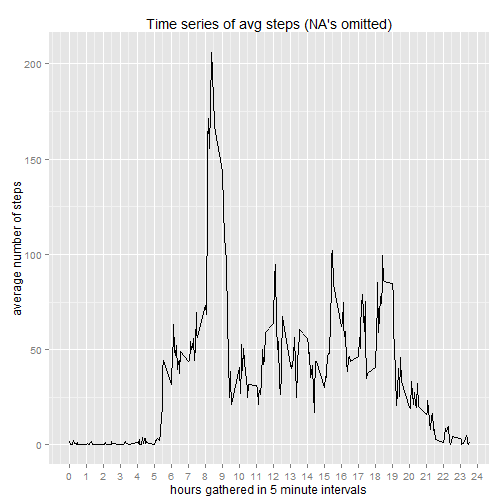

<<<<<<< HEAD
---
title: "PA1_template"  
author: "William F. Nicodemus"  
date: "July 23, 2015"  
output: html_document
keep_md: yes  
--- 

# Reprocible Reseach Project: Peer Assesment 1 #    

This assignment makes use of data from a personal activity monitoring device. This device collects data at 5 minute intervals through out the day. The data consists of two months of data from an anonymous individual collected during the months of October and November, 2012 and include the number of steps taken in 5 minute intervals each day.

## Data ##

The data for this assignment can be downloaded from the course web site:  

Dataset: [Activity monitoring data](https://d396qusza40orc.cloudfront.net/repdata%2Fdata%2Factivity.zip)

The variables included in this dataset are:  

- steps: Number of steps taking in a 5-minute interval (missing values are coded as NA)  

- date: The date on which the measurement was taken in YYYY-MM-DD format  

- interval: Identifier for the 5-minute interval in which measurement was taken  

The dataset is stored in a comma-separated-value (CSV) file and there are a total of 17,568 observations in this dataset.  


## Loading and preprocessing the data ## 

```r
#          download, unzip and read data. 
setInternet2(use = TRUE) #                      this is necessary in Windows
url<-"https://d396qusza40orc.cloudfront.net/repdata%2Fdata%2Factivity.zip"
if (!file.exists("PA1")) {
         dir.create("PA1")}
if (!file.exists("PA1/activity.zip")){
         url<-"https://d396qusza40orc.cloudfront.net/repdata%2Fdata%2Factivity.zip"
         download.file(url,destfile = "PA1/activity.zip" )
}
if(!file.exists("PA1/activity.csv")){
unzip(zipfile = "PA1/activity.zip")
}
padata<-read.csv("activity.csv",stringsAsFactors = F)
padata$date<-as.Date(padata$date)
head(padata,3)
```

```
##   steps       date interval
## 1    NA 2012-10-01        0
## 2    NA 2012-10-01        5
## 3    NA 2012-10-01       10
```
## What is mean total number of steps taken per day? ##    

- For this part of the assignment, you can ignore the missing values in the dataset.


```r
omitdata<-na.omit(padata)
```

- Calculate the total number of steps taken per day

```r
library(dplyr)
databyDate<- omitdata %>% group_by(date) %>% summarize(steps = sum(steps, na.rm = TRUE))
```
- Make a histogram of the total number of steps taken each day

```r
library(ggplot2)
g <- ggplot(databyDate, aes(x = steps))
g <- g + geom_histogram(fill="yellow",color="darkgreen") + 
        geom_vline(aes(xintercept=mean(databyDate$steps,na.rm = TRUE),color="Mean"),show_guide = T) +
        geom_vline(aes(xintercept=median(databyDate$steps,na.rm = TRUE),color="Median"),show_guide = T) + 
        scale_colour_manual(name='Calcs', values=c('Mean'='blue', 'Median'='red')) +
        ggtitle("Total number of steps per day (NA's omitted)")
g
```

 

- Calculate and report the mean and median of the total number of steps taken per day 

```r
meanDay<-round(mean(databyDate$steps,na.rm = TRUE),3)
cat("mean steps per day:",meanDay)
```

```
## mean steps per day: 10766.19
```

```r
medianDay<-round(median(databyDate$steps,na.rm = TRUE),3)
cat("median steps per day:",medianDay)
```

```
## median steps per day: 10765
```
## What is the average daily activity pattern?## 

- Make a time series plot (i.e. type = "l") of the 5-minute interval (x-axis) and the average number of steps taken, averaged across all days (y-axis)

```r
databyInterval<- omitdata %>% group_by(interval) %>% summarize(steps = mean(steps, na.rm = TRUE))
g <- ggplot(databyInterval, aes(x = interval,y=steps)) +
        geom_line() + scale_x_continuous(breaks=seq(0,2400, by=100),label=c(0:24)) +
        xlab("hours gathered in 5 minute intervals") + ylab("average number of steps") +
        ggtitle("Time series of avg steps (NA's omitted)")
g
```

 

- Which 5-minute interval, on average across all the days in the dataset, contains the maximum number of steps?  

```r
maxintv<-databyInterval[databyInterval$steps==max(databyInterval$steps),]
cat("The maximun steps is observed in the five minute interval starting on",as.character(maxintv[1,1]/100),"am averaging", round(as.numeric(maxintv[1,2]),digits=2),"steps")
```

```
## The maximun steps is observed in the five minute interval starting on 8.35 am averaging 206.17 steps
```
## Imputing missing values##

- Calculate and report the total number of missing values in the dataset. 

```r
cat("Total number of missing values: ",sum(is.na(padata)))
```

```
## Total number of missing values:  2304
```
- Devise a strategy for filling in all of the missing values in the dataset.    
       *My strategy is to replace missing values with the interval average, that is, substitute the NA value for the average value corresponding to its interval. The average for each interval was calculated above.*

- Create a new dataset that is equal to the original dataset but with the missing data filled in.  


```r
imputedData <- padata 
for (i in 1:nrow(imputedData)) {
        if (is.na(imputedData$steps[i])) {
                imputedData$steps[i] <- databyInterval[which(imputedData$interval[i] == databyInterval$interval), ]$steps
        }
}
cat("Total number of missing values after imputing NAs: ",sum(is.na(imputedData))) 
```

```
## Total number of missing values after imputing NAs:  0
```

- Make a histogram of the total number of steps taken each day  
  

```r
impdatabysteps<- imputedData %>% group_by(date) %>% summarize(steps = sum(steps, na.rm = TRUE))
g <- ggplot(impdatabysteps, aes(x = steps))
g <- g + geom_histogram(fill="yellow",color="darkgreen") + 
        geom_vline(aes(xintercept=mean(impdatabysteps$steps,na.rm = TRUE),color="Mean", linetype="Mean"), size=1, show_guide=TRUE) +
        geom_vline(aes(xintercept=median(impdatabysteps$steps,na.rm = TRUE),color="Median", linetype="Median"), size=1, show_guide=TRUE) +
        ggtitle("Histogram of total number of steps (NA's imputed)")
g
```

 

 - Calculate and report the mean and median total number of steps taken per day.   

```r
impdatabysteps<- imputedData %>% group_by(date) %>% summarize(steps = sum(steps, na.rm = TRUE))
imeanDay<-mean(impdatabysteps$steps,na.rm = TRUE)  
imedianDay<-median(impdatabysteps$steps,na.rm = TRUE)  
impDiffdel<-data.frame(rbind(mean=c(imeanDay,meanDay,imeanDay-meanDay),median=c(imedianDay,medianDay,imedianDay-medianDay)))
names(impDiffdel)<-c("imputed NAs","deleted NAs","difference")
impDiffdel
```

```
##        imputed NAs deleted NAs    difference
## mean      10766.19    10766.19 -0.0003207547
## median    10766.19    10765.00  1.1886792453
```
   
- Do these values differ from the estimates from the first part of the assignment?      
        *No, the values are very similar as seen above in their means and medians*  
- What is the impact of imputing missing data on the estimates of the total daily number of steps?  
        *The means are virtually the same but there is a slight shift in the median*    

## Are there differences in activity patterns between weekdays and weekends?##

```r
imputedData$wkpart <- as.factor(ifelse(weekdays(imputedData$date,abbreviate=T) %in% c("Sat","Sun"),"weekend", "weekday"))
table(imputedData$wkpart)
```

```
## 
## weekday weekend 
##   12960    4608
```
- Make a time series plot (i.e. type = "l") of the 5-minute interval (x-axis) and the average number of steps taken, averaged across all days (y-axis)

```r
wkpartNintvData<- imputedData %>% group_by(wkpart,interval) %>% summarize(steps = mean(steps, na.rm = TRUE))
g <- ggplot(wkpartNintvData, aes(x = interval,y=steps,color=wkpart)) 
g<-g+geom_line() + scale_x_continuous(breaks=seq(0,2400,by=100),label=c(0:24)) +
        xlab("hours gathered in 5 minute intervals") +
        ylab("average number of steps") + facet_grid(wkpart~.) +
        ggtitle("Time Series Plot: Weekdays vs. Weekends")
g
```

 
   
   * *In the morning intervals, there is a slight reduction of steps on weekends*
   * *In the afternoun and evening intervals, there is a slight increase on weekends*
  
